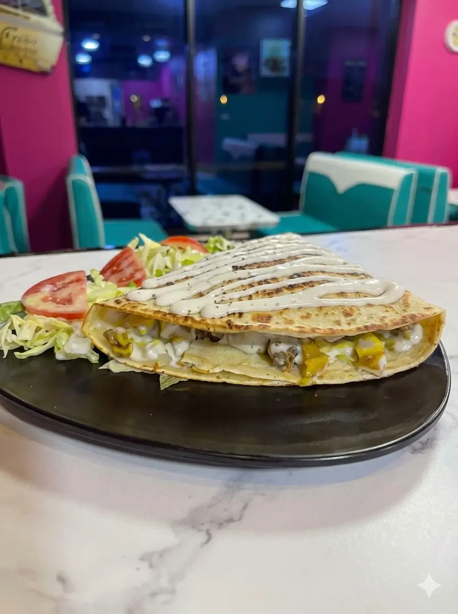

# 🔍 Audit SEO - Le Marvelous Crêperie

**Date :** Décembre 2024
**URL :** https://marvelous.mon-agenceweb.fr
**Analysé par :** Claude Agent

---

## ✅ Points Forts (Déjà Bien Configurés)

### 1. Meta Tags Essentiels
✅ **Title Tag** - Optimisé et descriptif
```html
<title>Le Marvelous - Diner 50's · Crêpes, Gaufres & Coffee | Ouled Moussa</title>
```
- ✅ Contient le nom du restaurant
- ✅ Contient les mots-clés principaux
- ✅ Contient la localisation
- ✅ Longueur : ~70 caractères (idéal)

✅ **Meta Description** - Bien rédigée
```html
<meta name="description" content="Le Marvelous à Ouled Moussa : crêpes salées signature, crêpes sucrées, gaufres, boissons et menu enfant. Salle familles et salle femmes disponibles.">
```
- ✅ Décrit bien l'offre
- ✅ Contient des mots-clés locaux
- ✅ Longueur : ~155 caractères (idéal)

✅ **Meta Keywords**
```html
<meta name="keywords" content="crepes ouled moussa, gaufres algerie, restaurant ouled moussa, le marvelous, diner 50s, coffee shop algerie">
```

✅ **Canonical URL**
```html
<link rel="canonical" href="https://marvelous.mon-agenceweb.fr/">
```

✅ **Robots**
```html
<meta name="robots" content="index, follow">
```

---

### 2. Open Graph (Facebook/WhatsApp)
✅ **Toutes les balises essentielles présentes**
- `og:type` = restaurant ✅
- `og:url` ✅
- `og:title` ✅
- `og:description` ✅
- `og:image` (1200x630) ✅
- `og:locale` = fr_FR ✅

**Score : 10/10** 🎯

---

### 3. Twitter Card
✅ **Configuration complète**
- `twitter:card` = summary_large_image ✅
- `twitter:title` ✅
- `twitter:description` ✅
- `twitter:image` ✅

**Score : 10/10** 🎯

---

### 4. Schema.org Structured Data
✅ **Excellent !** Type `Restaurant` avec toutes les infos :
- ✅ Nom, URL, téléphone
- ✅ Adresse complète + coordonnées GPS
- ✅ Horaires d'ouverture détaillés
- ✅ Type de cuisine
- ✅ Gamme de prix
- ✅ Menu sections

**Impact :** Aide Google à afficher votre restaurant dans :
- Google Maps
- Google Business Profile
- Rich snippets de recherche

**Score : 10/10** 🎯

---

### 5. Performance
✅ **Optimisations présentes :**
- Preconnect pour Google Fonts
- Preconnect pour CDN Font Awesome
- CSS externe minifié

---

### 6. Mobile-Friendly
✅ **Viewport configuré**
```html
<meta name="viewport" content="width=device-width, initial-scale=1.0">
```

✅ **Design responsive** (vérifié dans CSS)

---

### 7. Favicons & Icons
✅ **Complet**
- Favicon PNG
- Apple touch icon
- Manifest.json
- Theme color

---

## ⚠️ Points à Améliorer

### 1. Images - Alt Tags
**Problème :** Manque de balises `alt` sur les images

**Impact SEO :** Moyen
- Google ne peut pas "lire" les images sans alt
- Accessibilité réduite pour les malvoyants
- Perte de ranking images

**Solution :**
```html
<!-- Actuellement -->


<!-- Devrait être -->

```

**À faire :**
- Ajouter `alt` à TOUTES les images
- Décrire précisément chaque image
- Inclure mots-clés naturellement

**Priorité : HAUTE** 🔴

---

### 2. Balises H1, H2, H3 - Hiérarchie
**Vérification nécessaire :**

✅ **H1** - Doit être unique et contenir le nom du restaurant
```html
<!-- Bon exemple -->
<h1>Le Marvelous - Crêperie Diner 50's à Ouled Moussa</h1>
```

⚠️ **H2** - Pour les sections principales (catégories)
⚠️ **H3** - Pour les sous-sections

**À vérifier :**
- Une seule balise H1 par page
- Hiérarchie logique H1 → H2 → H3
- Mots-clés dans les titres

**Priorité : MOYENNE** 🟡

---

### 3. Sitemap XML
**Problème :** Pas de sitemap.xml détecté

**Impact SEO :** Moyen
- Google indexe plus lentement
- Moins de contrôle sur l'indexation

**Solution :** Créer `/sitemap.xml`

```xml
<?xml version="1.0" encoding="UTF-8"?>
<urlset xmlns="http://www.sitemaps.org/schemas/sitemap/0.9">
    <url>
        <loc>https://marvelous.mon-agenceweb.fr/</loc>
        <lastmod>2024-12-24</lastmod>
        <changefreq>daily</changefreq>
        <priority>1.0</priority>
    </url>
    <url>
        <loc>https://marvelous.mon-agenceweb.fr/cart.html</loc>
        <changefreq>monthly</changefreq>
        <priority>0.8</priority>
    </url>
</urlset>
```

**Priorité : MOYENNE** 🟡

---

### 4. Robots.txt
**Problème :** Pas de robots.txt détecté

**Impact SEO :** Faible à moyen

**Solution :** Créer `/robots.txt`

```
User-agent: *
Allow: /

Sitemap: https://marvelous.mon-agenceweb.fr/sitemap.xml

# Bloquer dossiers admin
Disallow: /admin-panel-v2/
Disallow: /config/
```

**Priorité : MOYENNE** 🟡

---

### 5. Contenu Textuel
**Problème potentiel :** Peu de contenu texte visible

**Impact SEO :** Moyen
- Google préfère les pages avec du contenu riche
- Difficulté à ranker sur des mots-clés long-tail

**Solution :** Ajouter du contenu :

**Section "À Propos" :**
```html
<section class="about-section">
    <h2>Bienvenue au Marvelous - Votre Diner 50's à Ouled Moussa</h2>
    <p>
        Depuis [année], Le Marvelous vous accueille dans une ambiance authentique
        de Diner américain des années 50. Spécialisés dans les crêpes salées et
        sucrées, nous proposons également des gaufres artisanales et un large
        choix de boissons chaudes et froides.
    </p>
    <p>
        Situés à Ouled Moussa (Boumerdes), nous disposons d'une salle familles
        et d'une salle femmes pour votre confort. Notre équipe vous prépare des
        produits frais tous les jours.
    </p>
</section>
```

**Section "Nos Spécialités" :**
```html
<section class="specialties-section">
    <h2>Nos Spécialités Maison</h2>
    <h3>Crêpes Salées Signature</h3>
    <p>Nos crêpes salées sont préparées avec des ingrédients frais...</p>

    <h3>Crêpes Sucrées & Gaufres</h3>
    <p>Pour les gourmands, découvrez nos crêpes sucrées...</p>
</section>
```

**Priorité : MOYENNE** 🟡

---

### 6. URLs Sémantiques
**Actuellement :** Seulement `index.html` et `cart.html`

**Amélioration possible :** Ajouter des pages catégories
- `/crepes-salees.html`
- `/crepes-sucrees.html`
- `/gaufres.html`
- `/boissons.html`

**Impact SEO :** Moyen - Permet de ranker sur plus de mots-clés

**Priorité : BASSE** 🟢

---

### 7. Vitesse de Chargement
**À tester avec :**
- Google PageSpeed Insights
- GTmetrix
- WebPageTest

**Optimisations recommandées :**
- ✅ CSS minifié
- ⚠️ Images optimisées (WebP)
- ⚠️ Lazy loading pour images
- ⚠️ Cache navigateur
- ⚠️ Compression GZIP

**Solution Images :**
```html
<!-- Ajouter loading="lazy" -->

```

**Priorité : HAUTE** 🔴

---

### 8. Liens Internes
**Vérifier :**
- Navigation claire entre pages
- Breadcrumbs si nécessaire
- Liens vers catégories

**Priorité : BASSE** 🟢

---

### 9. Google Business Profile
**Action :** S'assurer que Google Business Profile est :
- ✅ Créé et vérifié
- ✅ À jour avec les infos du site
- ✅ Lien vers le site web
- ✅ Photos récentes
- ✅ Réponses aux avis

**Priorité : HAUTE** 🔴

---

### 10. Réseaux Sociaux
**Vérifier :**
- Liens vers réseaux sociaux présents
- Boutons de partage
- Intégration Instagram feed ?

**Priorité : BASSE** 🟢

---

## 📊 Score SEO Global

### Technique : 8.5/10 ⭐⭐⭐⭐
- Meta tags excellents
- Schema.org parfait
- Open Graph complet
- Structure HTML propre

### Contenu : 6/10 ⚠️
- Manque de contenu texte
- Alt tags manquants
- Besoin de plus de pages

### Performance : 7/10 🟡
- Optimisations de base OK
- Besoin de tests réels
- Images à optimiser

### Local SEO : 9/10 🎯
- Adresse complète
- Horaires détaillés
- Téléphone présent
- Coordonnées GPS

---

## 🎯 Plan d'Action Prioritaire

### 🔴 URGENT (Cette semaine)
1. **Ajouter alt tags à toutes les images**
2. **Optimiser les images (WebP, compression)**
3. **Tester vitesse avec PageSpeed Insights**
4. **Vérifier Google Business Profile**

### 🟡 IMPORTANT (Ce mois)
5. **Créer sitemap.xml**
6. **Créer robots.txt**
7. **Ajouter section "À Propos"**
8. **Ajouter section "Nos Spécialités"**
9. **Vérifier hiérarchie H1/H2/H3**

### 🟢 À PLANIFIER (3 mois)
10. Créer pages catégories séparées
11. Ajouter blog (optionnel)
12. Intégration réseaux sociaux
13. Programme de fidélité SEO

---

## 📝 Checklist Maintenance SEO Mensuelle

- [ ] Vérifier positions Google (keywords tracking)
- [ ] Analyser Google Search Console
- [ ] Vérifier liens cassés
- [ ] Mettre à jour contenu
- [ ] Vérifier concurrents
- [ ] Analyser trafic Google Analytics
- [ ] Répondre aux avis Google
- [ ] Poster sur réseaux sociaux

---

## 🛠️ Outils Recommandés

### Gratuits
- **Google Search Console** - Suivi indexation
- **Google Analytics** - Statistiques trafic
- **Google PageSpeed Insights** - Performance
- **Schema.org Validator** - Vérifier structured data

### Payants (optionnels)
- **Semrush** - Analyse concurrence & keywords
- **Ahrefs** - Backlinks & SEO
- **Screaming Frog** - Crawl technique

---

## 📈 Objectifs SEO

### Court terme (1-3 mois)
- [ ] Apparaître dans top 3 pour "crêperie Ouled Moussa"
- [ ] Apparaître dans top 5 pour "restaurant Ouled Moussa"
- [ ] 100+ visiteurs organiques/mois

### Moyen terme (6 mois)
- [ ] Top 1 pour "crêperie Ouled Moussa"
- [ ] Apparaître pour "crêperie Boumerdes"
- [ ] 500+ visiteurs organiques/mois

### Long terme (1 an)
- [ ] Dominer la recherche locale Boumerdes
- [ ] 1000+ visiteurs organiques/mois
- [ ] 50+ avis Google 4+ étoiles

---

**Conclusion :** Le site a une excellente base SEO technique. Les améliorations prioritaires concernent surtout le contenu (images alt, texte) et la performance. Avec ces ajustements, vous devriez voir une amélioration significative du ranking local.

**Contact :** Pour toute question SEO, consultez ce document ou contactez un expert SEO local.
